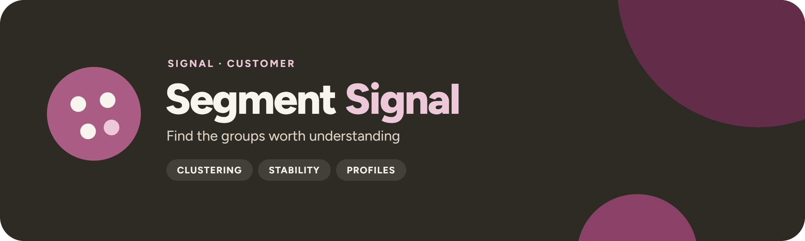

<p align="center">
  
</p>

<p align="center">
  <a href="https://github.com/UlrikErlingsen/customer-segmentation/actions"></a>
  <a href="https://github.com/UlrikErlingsen/signal-hub"></a>
  
  
  <a href="LICENSE"></a>
</p>

<p align="center"><strong>Open B2C customer segmentation for marketers — guided methods, stability checks, local-first data.</strong></p>

**Segment Signal** turns a customer table or transaction log into testable customer segments through a point-and-click Streamlit app. Choose what should form the groups, compare several algorithms and segment counts, see whether customer memberships survive resampling, profile the chosen solution, edit the names, and download the customer-to-segment map. No account or statistics software is required.

> Do customers form stable, useful groups?

Everything runs locally with open-source Python packages. There is no account, telemetry, advertising, external AI call, remote database, or built-in customer-data storage.

## Read this first

> **Treat segments as decision support, not discovered truth.** Clusters are patterns in a particular sample. They depend on the business question, customers, variables, preprocessing, and model choices. A useful market can have no reliable cluster structure, and statistical separation does not prove that a segment is reachable, fair, or profitable.

Segment Signal is deliberately able to say **“no reliable segmentation found.”** That is often a better result than polished but unstable personas.

- The balanced evidence score is a navigation aid, not a hypothesis test. Every component is shown so you can disagree with it.
- The 2-D customer map is a projection for orientation, not validation. Segment names are editable descriptions, not facts about people.
- A cluster does not prove causality or justify discrimination. Accessibility, profitability, fairness, and operational fit cannot be inferred from cluster geometry; your team must evaluate them separately.

## Scope

**Version 1.2 supports:**

- customer-level tables (one row per customer) with needs ratings, survey scores, demographics, categories, benefits sought, product usage, purchase behavior, engagement, price sensitivity, or channel preferences — RFM and CLV fields are optional;
- transaction logs, aggregated into recency, frequency, monetary value, average order value, and tenure before clustering;
- `.csv`, `.xlsx`, `.xls`, `.xlsm`, and `.json` files with structured numeric, categorical, and boolean fields;
- segmentation bases kept separate from descriptors: needs, preferences, values, and behavior can form segments; demographics and channel fields can profile them without silently driving the clusters;
- K-means and Ward hierarchical clustering for numeric or mixed bases, Gaussian mixtures for numeric-only bases, and graph-based spectral clustering for smaller files with irregular group shapes — compared over a guided range of segment counts or any exact count from 2 to 50;
- separation, resampling stability, cross-method agreement, segment size, balance, and simplicity shown together;
- hierarchy views, original-unit profiles, editable names, membership confidence, and descriptive ANOVA for the chosen solution;
- business-question framing, plain-language controls, fictional demos, and portable exports in which preparation choices, the random seed, diagnostics, customer memberships, and profiles travel together.

Segment Signal is designed first for B2C markets, where there are usually enough individual customers for quantitative grouping and macro-targeting. Smaller B2B customer bases often require account-specific research, buying-center roles, firmographic context, and qualitative judgment that generic clustering cannot replace.

**It does not:** analyse raw text, images, or arbitrary model files, do geospatial modeling, survey weighting, or time-series sequence clustering, predict outcomes or future membership (regression and classification are not segmentation methods), estimate customer value, or measure product preferences. Where a sibling app covers it, use **[Worth Signal](https://github.com/UlrikErlingsen/customer-value-analytics)** for customer value, RFM targeting, CLV, retention, and marketing ROI, **[Choice Signal](https://github.com/UlrikErlingsen/conjoint-analysis)** for conjoint preference measurement, **[Text Signal](https://github.com/UlrikErlingsen/open-text-analysis)** for open-ended answers, and **[Measure Signal](https://github.com/UlrikErlingsen/measurement-validation)** to check a multi-item score before using it as a basis.

## Try the demo in three minutes

1. Start the app. The fictional **Behavior table** demo is preloaded, so there is nothing to upload (the sidebar demo buttons restore it or switch to another demo, and uploading your own file replaces it).
2. Open **1 · Data & purpose**. Review the automatically separated basis variables and descriptors, then save the setup.
3. Open **2 · Compare solutions**, keep the defaults, and run the comparison.
4. Carry the leading four-segment solution forward.
5. Open **3 · Profiles & export** to inspect the map, snake profile, membership uncertainty, names, and downloads, and export the evidence as XLSX, CSV, or JSON.

All demos are fictional, including the preloaded one. **Behavior table** has one ready-made row per customer. **Purchase log** has repeated orders that are aggregated into optional RFM variables. **Needs survey** contains attitudes, needs, demographics, and no RFM fields, demonstrating that the app is not tied to customer-value data. The demos are generated deterministically by `segmentsignal.examples`, and `scripts/generate_examples.py` writes the identical files to [`examples/`](examples/); they represent no real customer, organisation, course case, or empirical finding.

## Data contract

**Customer-level data:** one row per customer, one unique, nonblank ID, and any relevant structured variables. Any number of basis variables is allowed (the public demo takes up to 30), and at least 30 customers are required.

**Transaction data:** repeated rows with customer ID, purchase date, amount, and optional order ID. The app creates recency, frequency, monetary value, average order value, and tenure before clustering.

| customer_id | recency_days | purchase_frequency | annual_spend | engagement_score | discount_share | region | preferred_channel |
|---|---|---|---|---|---|---|---|
| C00001 | 14 | 12 | 940.50 | 8.1 | 0.10 | North | Email |

`examples/customer_template.xlsx` and `examples/customer_template.csv` show the customer-level shape.

Segment Signal reads `.csv`, `.xlsx`, `.xls`, `.xlsm`, and `.json`. Raw text, images, arbitrary model files, geospatial modeling, survey weighting, and time-series sequence clustering are outside this release.

### Data limits

**Run locally there is no built-in limit** on file size, rows, cells or customers: your computer's memory is the limit. Streamlit's upload cap defaults to 10,000 MB (`SEGMENTSIGNAL_MAX_UPLOAD_MB` in the launchers, `STREAMLIT_SERVER_MAX_UPLOAD_SIZE` in Docker). If a file or step needs more memory than the computer has, the app says so plainly instead of crashing. Above 200 prepared model columns the app warns that distances between customers become less informative.

Every customer is prepared, profiled and exported. Because the comparison refits every candidate many times, tables above 25,000 customers are compared and fitted on a seeded random sample of 25,000 customers by default; you can raise it up to every customer on page 2. Every other customer is then assigned to the nearest segment (or the most probable Gaussian-mixture component), and the app and every export record the sample. Ward and spectral clustering compare every pair of customers, so their memory grows with the square of the sample; they stay available but are not defaults on large samples. On screen, charts show at most 5,000 customers. The Excel pack holds the customer-to-segment map when it fits on one sheet (1,048,575 rows); the CSV and JSON downloads always hold every customer.

**The public online demo** (`SIGNAL_PUBLIC=1`) keeps hard caps to protect a shared server: 200 MB per upload (50 MB for JSON), 400 MB of expanded Excel content, 1 million rows and 10 million cells per file, 25,000 analyzed customers, 30 basis variables, 200 model columns, 5,000 customers for Ward and 2,500 for spectral clustering. Its messages say they are demo limits; the downloaded app has none. All caps live in `src/segmentsignal/limits.py`.

On a 24-thread desktop with 32 GB of memory, a 5-million-customer CSV (305 MB) loaded in about 7 seconds and the whole workflow ran in about 1.5 minutes with a peak of about 2.1 GB of memory; a 10-million-row purchase log (335 MB) loaded in about 10 seconds and aggregated to 1.5 million customers in about 17 seconds, with a peak of about 3.1 GB. CSV is the fastest format for very large tables: JSON needs several times its size in memory, and Excel reads at roughly 150,000 cells per second (a 300,000-row, 12-column workbook took 23 seconds).

See [the data guide](docs/data_guide.md).

## Analysis contract

Before any model runs, the setup on page 1 records the choices that keep the analysis honest. They are saved with the setup and travel into every export:

1. **Purpose.** The decision that the segmentation should support (messages, products, channels, needs, or exploration).
2. **Data audit.** Missingness, duplicates, likely IDs, PII, sensitive fields, and low-variation columns are reviewed first. Likely direct identifiers are excluded from automatic basis suggestions.
3. **Roles.** One customer ID, the segmentation bases, the descriptors, and exclusions. Bases form the groups; descriptors only explain and reach them.
4. **Preparation.** Median imputation for numerics, an explicit `Missing` level for categories, optional 1st/99th-percentile limits and log transforms for strong skew, standardization of numeric scales (optional when all bases already share one scale, such as Choice Signal part-worths), one-hot encoding of categorical bases, and a categorical weight.

## Methods

1. **Compare candidates.** Use the guided range (3–6 by default, because a segmentation must remain manageable) or test exact counts from 2 up to 50 (and below the customer count), then compare separation, stability, size, agreement, and parsimony. Warnings remain visible, but unusual choices are not blocked.
2. **Make the decision.** Select a candidate—or accept that the data do not support a reliable segmentation. After a comparison you can also fit any method-and-count combination directly, including combinations that were not compared, clearly marked as untested custom fits.
3. **Profile and export.** Review original-unit means, indexed category patterns, editable names, customer memberships, uncertainty, and a reproducibility trail.

Segment Signal reports:

- silhouette score;
- Calinski–Harabasz score;
- Davies–Bouldin index;
- repeated 80% subsample stability using adjusted Rand agreement;
- agreement between algorithms at the same segment count;
- smallest and largest segment share;
- a transparent balanced evidence score with a modest simplicity preference;
- GMM AIC/BIC in the detailed diagnostics;
- row-level relative membership confidence.

Gaussian mixtures are omitted when the basis contains categorical or binary fields, and spectral clustering is limited to 2,500 customers. Hierarchy views (an icicle of splits and a truncated dendrogram) are shown for files up to 5,000 customers; they support judgment about a segment count and are not a test. The descriptive ANOVA is not a hypothesis test, because the segments were built to maximize exactly those differences.

The balanced score is a navigation aid, not a hypothesis test. The app shows every component so a user can disagree. Thresholds are documented as cautious heuristics, not universal laws. See [methods and references](docs/methods.md).

## Decision statuses

Each candidate receives an evidence label from cautious heuristics on silhouette, stability, smallest segment share, and sample size. These thresholds are not published laws.

- **STRONG**: silhouette at least 0.45, stability at least 0.80, smallest segment at least 5%, at least 300 customers and 30 per segment.
- **PROMISING**: silhouette at least 0.25, stability at least 0.65, smallest segment at least 3%, at least 100 customers and 20 per segment.
- **EXPLORATORY**: silhouette at least 0.12, stability at least 0.50, smallest segment at least 2%, at least 5 customers per segment. Validate on new data and with the people who must use it before activation.
- **WEAK**: anything below the exploratory bounds.
- **NO RELIABLE SEGMENTATION FOUND**: every candidate is weak. The top row is shown only as the least-weak option; reconsider the question and bases, collect better data, or use transparent rule-based groups.

A Promising or Strong label also requires at least four successful stability repeats. A user may still reject a statistically strong result because it is not measurable, accessible, differentiable, actionable, profitable, fair, or aligned with organizational capabilities. See [methods](docs/methods.md#balanced-evidence-score).

## Exports

The Excel pack, the customer-segment CSV, and the JSON audit trail include:

- the source filename and a SHA-256 fingerprint of the ID and basis columns;
- the purpose, basis and descriptor variables, preprocessing audit, comparison settings, random seed, and software and library versions;
- the customer-to-segment map with editable segment names and membership confidence;
- the segment summary, numeric and categorical profiles, the chosen diagnostics, all candidates, and candidate failures;
- the interpretation caution: patterns in this sample, not causal findings or objective customer types.

The candidate diagnostics can also be downloaded as CSV. The customer-to-segment map contains the customer ID column you chose, so use pseudonymous IDs. Excel and CSV cells and headers are neutralised against spreadsheet-formula interpretation, and Excel sheet names are scrubbed.

## Run locally

You need Python 3.10 or newer and a local copy of this folder. Download this project from GitHub and unzip it, or clone it:

```bash
git clone https://github.com/UlrikErlingsen/customer-segmentation.git
cd customer-segmentation
```

**macOS:** double-click `run_app.command`; the browser opens automatically after the local server is ready. **Windows:** double-click `run_app.bat`.

The first start creates a private `.venv` folder and installs the required packages, which can take a few minutes. Later starts reuse it without requiring a network connection. The launcher automatically notices dependency changes after an update. Or use a terminal:

```bash
python3 -m venv .venv
source .venv/bin/activate  # Windows: .venv\Scripts\activate
python -m pip install -r requirements.txt
python -m streamlit run app.py
```

Segment Signal prefers local port 8501; the macOS launcher falls back to the next free port up to 8599. The macOS launcher accepts `SEGMENTSIGNAL_PORT` and `SEGMENTSIGNAL_NO_BROWSER=1`. Both launchers accept `SEGMENTSIGNAL_MAX_UPLOAD_MB` (default 10000), Streamlit's upload cap in MB; `SEGMENTSIGNAL_DEBUG=1` reveals technical details for unexpected errors.

### Docker

```bash
docker build -t segmentsignal .
docker run --rm -p 8501:8501 segmentsignal
```

Then open http://127.0.0.1:8501. The container runs as a non-root user, keeps the application code read-only, and includes a health check. The image sets `STREAMLIT_SERVER_MAX_UPLOAD_SIZE=10000` (MB); pass `-e STREAMLIT_SERVER_MAX_UPLOAD_SIZE=<MB>` to `docker run` for another cap, and `-e SIGNAL_PUBLIC=1` for the public-demo caps.

## Privacy

Local mode keeps the file in the running process on your computer. Hosted mode sends it to the chosen host, so the operator is responsible for access control, logs, retention, and legal compliance. Read [PRIVACY.md](PRIVACY.md) before using personal or confidential data.

Remove names and contact details, use pseudonymous IDs, minimize variables, and review sensitive attributes and proxies. A cluster does not prove causality or justify discrimination. Macro-targeting will inevitably include some nonmembers and miss some true members.

## No install? Give this file to an AI

Don't want to install anything? [AI_ANALYST.md](AI_ANALYST.md) is a single copy-paste file that turns a capable AI assistant (Claude, ChatGPT, Gemini, …) into this analysis. Copy the file into a chat, add your data, and the AI follows the same published methods and honesty rules as the app. The app is still the more private option: local mode keeps your data on your computer, while a cloud AI sees whatever you paste.

## Development

```bash
python -m pip install -e ".[test]"
python -m pytest
python -m ruff check .
python -m build
```

The analysis core (`segmentsignal`) installs without Streamlit or Plotly; the app needs the `ui` extra (`python -m pip install -e ".[ui]"`), and `requirements.txt` lists everything for the launchers and Docker. [Signal Hub](https://github.com/UlrikErlingsen/signal-hub) embeds the app through `segmentsignal.ui.render()`.

The independent statistical and app tests check data loading and validation, feature engineering and preparation, every clustering method and diagnostic, profiles and formula-safe exports, every Streamlit page and demo path, the shared Signal shell, and the Signal Hub contract (no Streamlit or Plotly import outside `ui/`, `render()` without a page config, namespaced keys).

## Where this fits in Signal

Segment Signal focuses on multi-variable segment discovery, validation, profiling, and export. It does not duplicate its siblings: regression predicts an outcome; clustering forms groups; conjoint measures preferences. They are different jobs. **Tip:** join the exported segment column onto your transaction history and open it in Worth Signal to compare each segment’s value, retention, and CLV.

- [Worth Signal](https://github.com/UlrikErlingsen/customer-value-analytics) covers customer value, RFM targeting, CLV, retention, and marketing ROI; [Choice Signal](https://github.com/UlrikErlingsen/conjoint-analysis) covers conjoint analysis — what customers value in a product.
- [Adopt Signal](https://github.com/UlrikErlingsen/adoption-forecasting) forecasts when a new product gets adopted. [Position Signal](https://github.com/UlrikErlingsen/brand-positioning) maps how brands are perceived against competitors. [Driver Signal](https://github.com/UlrikErlingsen/survey-driver-analysis) finds which survey factors drive satisfaction.
- [Alloc Signal](https://github.com/UlrikErlingsen/marketing-mix-allocation) turns response assumptions into a budget allocation. [Gate Signal](https://github.com/UlrikErlingsen/launch-decision-gate) structures the go/hold/rework/kill investment decision. [Experiment Signal](https://github.com/UlrikErlingsen/experiment-analysis) tests whether a randomized treatment caused a meaningful change.
- [Measure Signal](https://github.com/UlrikErlingsen/measurement-validation) checks whether a multi-item score behaves like a defensible measure. [Text Signal](https://github.com/UlrikErlingsen/open-text-analysis) finds stable language patterns in open-ended answers.
- [Tag Signal](https://github.com/UlrikErlingsen/pricing-analysis) bounds pricing evidence from assigned-price experiments, historical variation, or willingness to pay; [Recommend Signal](https://github.com/UlrikErlingsen/recommender-evaluation) compares recommendation policies under temporal holdouts; [Trace Signal](https://github.com/UlrikErlingsen/journey-path-analysis) describes how logged customer journeys unfold, with no causal channel credit; and [Track Signal](https://github.com/UlrikErlingsen/brand-tracking) compares brand measures across tracking waves. None replaces segment discovery.

The analytical engines stay separate: [Signal Hub](https://github.com/UlrikErlingsen/signal-hub) launches or embeds each app, and shared branding lives in the small synced `signal_theme` module. The statistical modules are not merged into one large `app.py`.

<!-- signal-suite:start (generated from signal-hub/apps.yaml by scripts/sync_readme_suite.py) -->
| Family | App | Asks |
|---|---|---|
| Brand | [Track Signal](https://github.com/UlrikErlingsen/brand-tracking) | Is the brand moving, or is the tracker just noisy? |
| Brand | [Position Signal](https://github.com/UlrikErlingsen/brand-positioning) | Where do brands sit relative to competitors? |
| Market | [Prospect Signal](https://github.com/UlrikErlingsen/b2b-prospecting) | Which Norwegian companies fit your ideal customer, and which first? |
| Market | [Listen Signal](https://github.com/UlrikErlingsen/media-listening) | Who is talking about the brand in Norwegian media, and in what tone? |
| Market | [Influence Signal](https://github.com/UlrikErlingsen/influencer-campaigns) | Which creators delivered, and was every post labelled properly? |
| Market | [Season Signal](https://github.com/UlrikErlingsen/marketing-calendar) | What does the Norwegian marketing year look like, worked backwards? |
| Market | [Adopt Signal](https://github.com/UlrikErlingsen/adoption-forecasting) | When will a new product be adopted? |
| Market | [Rival Signal](https://github.com/UlrikErlingsen/competitor-analysis) | Which rivals matter, and how could they respond? |
| Market | [Reach Signal](https://github.com/UlrikErlingsen/location-catchment-analysis) | Where could a new location reach, and how would it share demand with existing sites? |
| Customer | [Worth Signal](https://github.com/UlrikErlingsen/customer-value-analytics) | What are customers and relationships worth? |
| Customer | **Segment Signal** (this app) | Do customers form stable, useful groups? |
| Customer | [Trace Signal](https://github.com/UlrikErlingsen/journey-path-analysis) | How do logged customer journeys actually unfold? |
| Customer | [Blueprint Signal](https://github.com/UlrikErlingsen/service-blueprinting) | How is the customer experience actually delivered, and where do the handoffs fail? |
| Customer | [Recommend Signal](https://github.com/UlrikErlingsen/recommender-evaluation) | Which recommendation policy should be tested live? |
| Research | [Choice Signal](https://github.com/UlrikErlingsen/conjoint-analysis) | How do product attributes drive choice? |
| Research | [Driver Signal](https://github.com/UlrikErlingsen/survey-driver-analysis) | Which measured experiences move with satisfaction? |
| Research | [Measure Signal](https://github.com/UlrikErlingsen/measurement-validation) | Does a multi-item score have a defensible structure? |
| Research | [Text Signal](https://github.com/UlrikErlingsen/open-text-analysis) | What recurring patterns appear in open-ended responses? |
| Research | [Tag Signal](https://github.com/UlrikErlingsen/pricing-analysis) | What price range is supported, and how does profit move? |
| Research | [Learn Signal](https://github.com/UlrikErlingsen/research-prioritization) | Which uncertainty is worth paying to research before you decide? |
| Decide | [Experiment Signal](https://github.com/UlrikErlingsen/experiment-analysis) | Did the treatment cause a practically meaningful change? |
| Decide | [Gate Signal](https://github.com/UlrikErlingsen/launch-decision-gate) | Does a concept deserve the next investment? |
| Decide | [Shift Signal](https://github.com/UlrikErlingsen/cannibalization-analysis) | Does a launch grow the portfolio, or move existing demand around? |
| Decide | [Alloc Signal](https://github.com/UlrikErlingsen/marketing-mix-allocation) | Where should the next marketing budget go? |

All 24 apps run side by side in [Signal Hub](https://github.com/UlrikErlingsen/signal-hub), each opening with fictional demo data. Every repo carries the [`signal-suite`](https://github.com/topics/signal-suite) topic, and the suite is listed at [ulrikerlingsen.com](https://ulrikerlingsen.com). Freddo CRM is a separate product.
<!-- signal-suite:end -->

## References

Formulas, thresholds, and implementation notes are in [docs/methods.md](docs/methods.md).

- Calinski, T., & Harabasz, J. (1974). A dendrite method for cluster analysis. *Communications in Statistics*, 3(1), 1–27.
- Davies, D. L., & Bouldin, D. W. (1979). A cluster separation measure. *IEEE Transactions on Pattern Analysis and Machine Intelligence*, PAMI-1(2), 224–227.
- Dolnicar, S., Grün, B., & Leisch, F. (2018). *Market Segmentation Analysis: Understanding It, Doing It, and Making It Useful*. Springer.
- Fraley, C., & Raftery, A. E. (2002). Model-based clustering, discriminant analysis, and density estimation. *Journal of the American Statistical Association*, 97(458), 611–631.
- Hubert, L., & Arabie, P. (1985). Comparing partitions. *Journal of Classification*, 2, 193–218.
- Lilien, G. L., Rangaswamy, A., & De Bruyn, A. (2017). *Principles of Marketing Engineering and Analytics* (3rd ed.). DecisionPro.
- MacQueen, J. (1967). Some methods for classification and analysis of multivariate observations. *Proceedings of the Fifth Berkeley Symposium on Mathematical Statistics and Probability*, 1, 281–297.
- Rousseeuw, P. J. (1987). Silhouettes: A graphical aid to the interpretation and validation of cluster analysis. *Journal of Computational and Applied Mathematics*, 20, 53–65.
- von Luxburg, U. (2007). A tutorial on spectral clustering. *Statistics and Computing*, 17(4), 395–416.
- Ward, J. H. (1963). Hierarchical grouping to optimize an objective function. *Journal of the American Statistical Association*, 58(301), 236–244.
- Wedel, M., & Kamakura, W. A. (2000). *Market Segmentation: Conceptual and Methodological Foundations* (2nd ed.). Kluwer Academic.

## Originality and license

The product name is **Segment Signal** (written “SegmentSignal” before version 1.2.0); the repository keeps the clear `customer-segmentation` name, and the package, file, and environment-variable names stay `segmentsignal` / `SEGMENTSIGNAL_*`. It is a sibling to Worth Signal in the Customer family of the Signal suite.

This app was built with AI assistance and reviewed against established market-segmentation and cluster-validation methods. All example customer records are synthetic. The workflow follows the published segmentation and cluster-validation literature cited in [docs/methods.md](docs/methods.md); no licensed third-party materials are included.

Contributions are welcome—see [CONTRIBUTING.md](CONTRIBUTING.md). Report vulnerabilities privately as described in [SECURITY.md](SECURITY.md). Cite the software with [CITATION.cff](CITATION.cff).

The software and documentation are free under **AGPL-3.0-or-later**. Commercial use is allowed, while distribution and modified network services carry source-sharing obligations described in the full [LICENSE](LICENSE). This summary is not legal advice; the license text controls. The license covers this project’s expression, not ownership of the published statistical methods it implements.

---

<p>
  
  <strong>Segment Signal</strong> is part of <a href="https://github.com/UlrikErlingsen/signal-hub"><strong>Signal</strong></a>, open marketing-evidence tools by <a href="https://ulrikerlingsen.com">Ulrik Erlingsen</a>.
</p>
